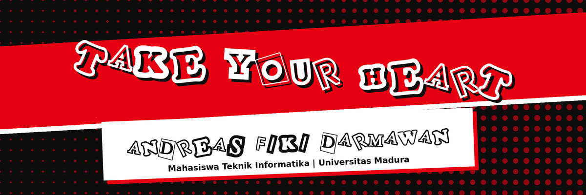

  

  

  
  
  

<b>Phantom Thieves of Code</b> Mahasiswa Teknik Informatika yang membangun aplikasi web dari tampilan sampai data.

---

> Live Must Go On.

**Sedang dipelajari:** Dart / Flutter, C++, MariaDB

| Proyek | Deskripsi | Peran | Tautan |
| --- | --- | --- | --- |
| **Tabulampot Tracker** | Aplikasi pencatat perawatan tanaman tabulampot dengan dashboard data nyata dan cuaca real-time. Proyek UAS kuliah yang dikerjakan berdua dengan rekan backend. | Frontend developer (SvelteKit 5, TypeScript, CSS murni) | [Repositori]( https://github.com/Seiken-02/Tabulampot) |
| **My Profile** | Portofolio biodata HTML pertama saya, bertema Phantom Thieves. Dibuat untuk tugas P1 Pemrograman Platform. | Pembuat tunggal (HTML, CSS, JavaScript) | [Repositori](https://github.com/021Andreas/My-Profile) |

 | [Lihat halaman Commits](https://github.com/021Andreas/My-Profile/commits/main)

| Tahun | Sekolah / Kampus | Jurusan | Pencapaian |
| --- | --- | --- | --- |
| 2024-sekarang | Universitas Madura | Teknik Informatika | - |
| 2021-2024 | SMKN 2 Pamekasan | Teknik Komputer Jaringan | - |
| 2018-2021 | SMP Ma'arif 4 Pamekasan | - | - |
| 2012-2018 | SDN Panglegur II Pamekasan | - | - |

| | |
| --- | --- |
| **Nama lengkap** | Andreas Fiki Darmawan |
| **Panggilan** | Andreas |
| **NIM** | 2024520021 |
| **Lokasi** | Pamekasan, Jawa Timur |
| **Surel** | andreasfikid@gmail.com |

Portofolio ini memakai estetika punk, kolase, halftone, dan kontras merah-hitam yang terinspirasi dari antarmuka Persona 5. Tema ini dipilih karena perjalanan belajar pemrograman terasa seperti menjalankan misi: penuh tantangan dan selalu ada yang baru untuk dicuri ilmunya.

---

Dibuat dengan ♥ oleh 021Andreas &mdash; P1 Pemrograman Platform 
<a href="LINK_VIDEO_P1">Video P1</a> | <a href="https://github.com/021Andreas/My-Profile">Repositori</a>

